

  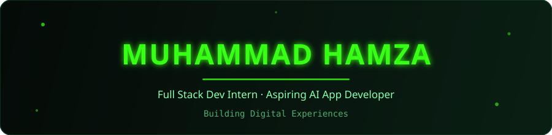

  

  
  
  
  
  

  

 

  

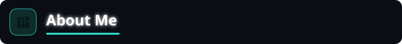

<table width="100%">
<tr>
<td width="55%" valign="top">

I'm a Computer Science undergraduate at **COMSATS University Islamabad, Wah Campus**, building backend systems and full-stack applications while developing a strong foundation in **AI and Cybersecurity**.

- 💼 Full Stack Development Intern @ **DecodeLabs**
- 📱 App Development Intern @ **CodeAlpha**
- 🏆 Certified in **Cybersecurity** (Cisco, Mastercard, Deloitte), **Software Development** (DATACOM), and **GenAI** (BCG X)
- 🤝 Completed a **Software Engineering job simulation** with **JPMorgan Chase & Co.**
- 🤖 Aspiring **AI App Developer**
- 🔐 Aspiring **Cybersecurity Analyst**
- 🧠 Strong grasp of **OOP, C++, and AI concepts**
- 📍 Based in **Wah Cantt, Pakistan**
- 📫 Reach me at [hamzaejaz3136@gmail.com](mailto:hamzaejaz3136@gmail.com)

</td>
<td width="45%" valign="top">

<table>
<tr><td>

🟢 🔵 🟣

| | |
|:--|:--|
| **Name** | Muhammad Hamza |
| **Role** | Full Stack Dev Intern |
| **Degree** | B.S. Computer Science |
| **University** | COMSATS Islamabad |
| **Graduating** | July 2028 |
| **Location** | Wah Cantt, Pakistan |
| **Focus** | AI App Development 🤖 |
| | Data Analyst 📊 |
| | Cybersecurity 🔐 |

</td></tr>
</table>

</td>
</tr>
</table>

  


<table width="100%">
<tr>
<th align="center">🎓 Degree</th>
<th align="center">💼 Internships</th>
<th align="center">🏅 Certifications</th>
<th align="center">🚀 Projects</th>
<th align="center">🔐 Focus</th>
</tr>
<tr>
<td align="center">B.S. CS — 2028</td>
<td align="center">2 Active/Completed</td>
<td align="center">13+ Earned</td>
<td align="center">7+ Shipped</td>
<td align="center">Cybersecurity · Data Analytics · App Dev</td>
</tr>
</table>

  
  
  
  

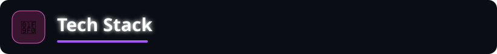

<marquee behavior="scroll" direction="left" scrollamount="6">
  
</marquee>

**Languages**

<table>
<tr>
<td align="center" width="110"> <b>Python</b></td>
<td align="center" width="110"> <b>Java</b></td>
<td align="center" width="110"> <b>C++</b></td>
<td align="center" width="110"> <b>C</b></td>
<td align="center" width="110"> <b>HTML</b></td>
</tr>
</table>

**Frameworks & Backend**

<table>
<tr>
<td align="center" width="110"> <b>Node.js</b></td>
<td align="center" width="110"> <b>Express</b></td>
<td align="center" width="110"> <b>MySQL</b></td>
<td align="center" width="110"> <b>MongoDB</b></td>
</tr>
</table>

**Tools**

<table>
<tr>
<td align="center" width="110"> <b>Git</b></td>
<td align="center" width="110"> <b>GitHub</b></td>
<td align="center" width="110"> <b>VS Code</b></td>
<td align="center" width="110"> <b>IntelliJ IDEA</b></td>
</tr>
</table>

**CS Concepts & Core Skills**

  
  
  
  
  
  
  
  
  
  
  
  

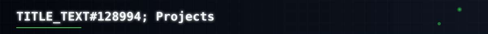

| Project | Description | Stack |
|---|---|---|
| 📋 **Backend User API** | RESTful backend with full CRUD (GET/POST/PUT/DELETE), validation middleware, and proper HTTP status codes — DecodeLabs Internship, Project 2 | `Node.js` · `Express` · `REST API` |
| 🎨 **Craft Studio Website** | Fully responsive landing page with CSS Grid & Flexbox, vanilla JS, mobile-first design and WCAG-conscious accessibility | `HTML5` · `CSS3` · `JavaScript` |
| ✈️ **Flight Management System** | Terminal-based airline reservation system for 10+ flight routes & 200+ passenger records, with booking, cancellation & search; extended with a MySQL backend via JDBC | `C++` · `OOP` · `MySQL` |
| 🧮 **DSA Practice** | Growing collection of data structures & algorithms implementations, including graph & search algorithms (BFS, DFS, A*, Dijkstra) | `C++` · `DSA` |

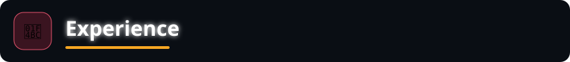

<table>
<tr>
<td width="8%" align="center" valign="top">🏢</td>
<td width="92%">

**Full Stack Development Intern** — DecodeLabs
*Jul 2026 – Present · Remote*

- Building backend  following industry-standard architecture &  practices
- Working through a structured full-stack training kit —    milestones

</td>
</tr>
</table>

<table>
<tr>
<td width="8%" align="center" valign="top">📱</td>
<td width="92%">

**App Development Intern** — CodeAlpha
*Jul 2026 · Remote*

- Contributed to  tasks during a short-term internship

</td>
</tr>
</table>

<table>
<tr>
<td width="8%" align="center" valign="top">🎓</td>
<td width="92%">

**BS Computer Science** — COMSATS University Islamabad, Wah Campus
*Aug 2024 – July 2028*

Coursework:

- 🚀 **Member**, Student Startup Business Society (SSBS)

</td>
</tr>
</table>

<table>
<tr>
<td width="8%" align="center" valign="top">🏫</td>
<td width="92%">

**Intermediate, Pre-Engineering** — FG Degree College
*2023 – 2024*

</td>
</tr>
</table>

<table>
<tr>
<td width="8%" align="center" valign="top">🏫</td>
<td width="92%">

**Matriculation, Science** — Sir Syed College Campus 2
*2021 – 2022*

</td>
</tr>
</table>

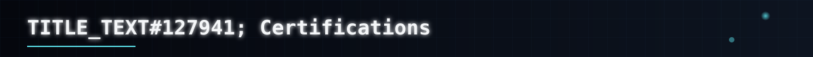

  
  
  
  
  
  

- **Deloitte** — Technology Job Simulation
- **Cisco Networking Academy** — Introduction to Cybersecurity
- **Mastercard** — Cybersecurity Job Simulation
- **BCG X** — GenAI Job Simulation
- **DATACOM** — Software Development Job Simulation
- **JPMorgan Chase & Co.** — Software Engineering Job Simulation

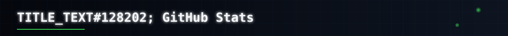

  
  

  


  


  

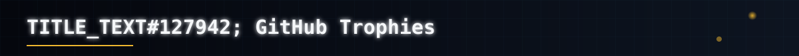

  

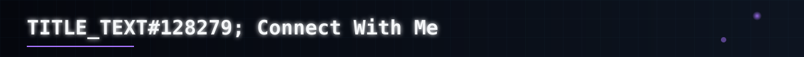

  

  
  
  

📧 **Email:** [hamzaejaz3136@gmail.com](mailto:hamzaejaz3136@gmail.com)
🔗 **LinkedIn:** [linkedin.com/in/hamza922](https://linkedin.com/in/hamza922)

  

<b>MQ</b>

<h2 align="center">"Getting your self tired in its peak command"</h2>

  <i>Consistency, discipline, and hands-on experience — that's how I grow as a person, and how I'm building my career as an aspiring AI app developer and cybersecurity enthusiast.</i>

  

